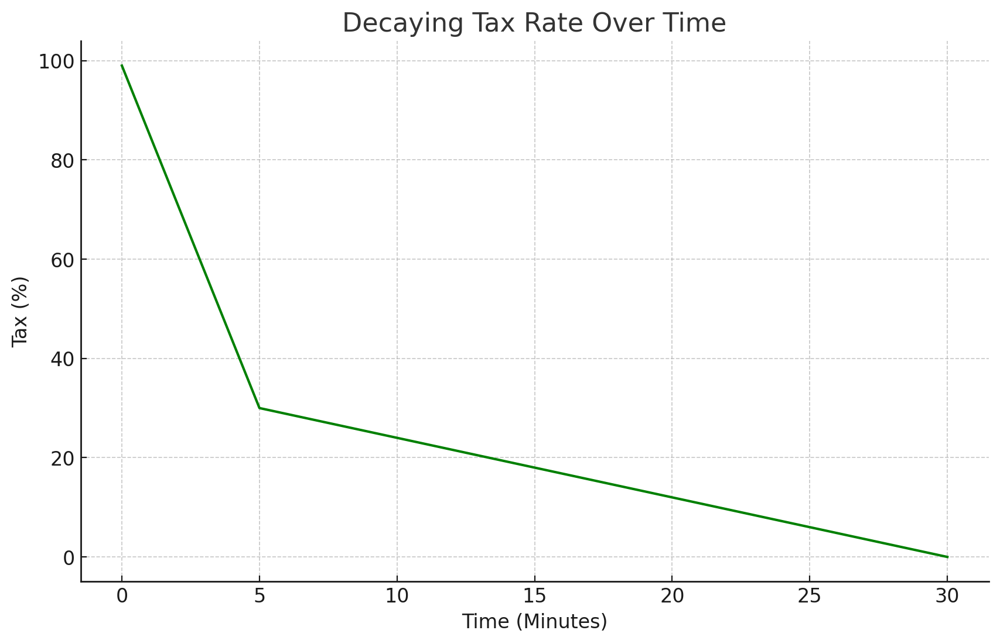

# ERC20DecayingFees

This is a prototype ERC20 token contract that demonstrates a decaying fee mechanism applied to transactions with a specified liquidity pool.

- Initial High Fee: The contract imposes a high initial fee of 99% at launch.
- Double Linear Decay:
    - In the first phase (for example, 0 to 5 minutes), the fee decreases linearly from 99% to 30%.
    - In the second phase (for example, 5 to 30 minutes), it further decreases from 30% to 0%.

- Fee Application: Fees are applied to both buy and sell transactions involving the liquidity pool.
- Fee Handling: Currently, fees are burned, reducing the overall token supply.

The contract serves as a conceptual demonstration of how decaying fees can be implemented in an ERC20 token, particularly for early-stage token trading to discourage rapid speculative transactions and bot activities.